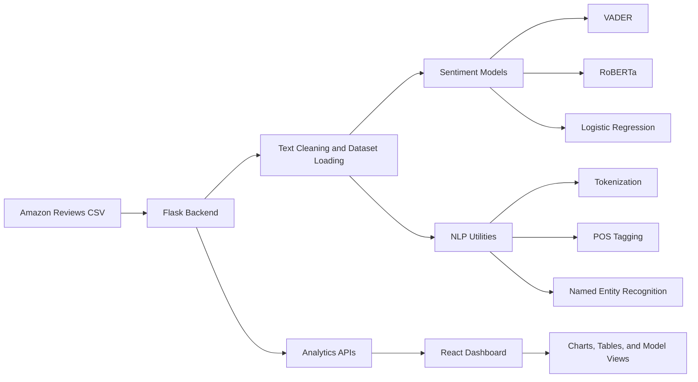

# Sentiment Intelligence Dashboard

Sentiment Intelligence Dashboard is a Flask and React application for analyzing Amazon product reviews with three complementary sentiment approaches:

- Logistic Regression with TF-IDF features
- VADER sentiment analysis
- RoBERTa sentiment analysis

It combines dataset exploration, NLP inspection, model comparison, unusual-review detection, and a dedicated machine-learning evaluation workflow.

## Overview

The project is designed to help users understand customer feedback from multiple angles:

- How the dataset is distributed
- How star ratings relate to sentiment
- How different models agree or disagree
- Which reviews look unusual or inconsistent
- How the custom machine-learning model performs against baseline approaches

The app is built as a full-stack dashboard:

- Flask serves the APIs and model logic
- React renders the analytics dashboard and interactive charts
- Recharts powers the visualizations

## Key Features

- Dashboard landing page with workflow navigation and product overview
- Analyze Review page for VADER, Logistic Regression, and RoBERTa predictions
- NLP Playground for tokenization, POS tagging, named entity recognition, and sentiment detail inspection
- Dataset Analysis page with rating distribution, sentiment distribution, search/filter controls, preview rows, and word clouds
- Model Comparison page with agreement metrics, trend charts, performance charts, and pairplot visualization
- Model Evaluation page for the custom TF-IDF + Logistic Regression classifier
- Unusual Reviews page for positive-sentiment/low-rating and negative-sentiment/high-rating mismatches
- Cached backend computations to reduce repeated inference

## Technology Stack

### Backend

- Python
- Flask
- Flask-CORS
- pandas
- numpy
- scipy
- NLTK
- transformers
- torch
- matplotlib
- seaborn

### Frontend

- React
- Vite
- TailwindCSS
- Recharts
- react-router-dom

### Models and Analysis

- VADER rule-based sentiment analysis
- RoBERTa transformer-based sentiment analysis
- Logistic Regression trained on TF-IDF features
- POS tagging and named entity recognition via NLTK

## Machine Learning Pipeline

The custom machine-learning model is trained on the Amazon reviews dataset using the following steps:

1. Text cleaning
2. Label mapping from rating to sentiment class
3. TF-IDF vectorization
4. Stratified train/test split
5. Logistic Regression training
6. Evaluation on the held-out test split
7. Export of model artifacts and evaluation report

### Label Mapping

- `Score >= 4` -> Positive
- `Score = 3` -> Neutral
- `Score <= 2` -> Negative

### Saved Artifacts

- `models/logistic_regression_model.pkl`
- `models/tfidf_vectorizer.pkl`
- `results/ml_evaluation.json`

## System Architecture



## Project Structure

```text
Sentiment_Analysis/
├── backend/
│   └── ml_model.py
├── dataset/
│   ├── .gitkeep
│   └── Reviews.csv                # local-only, not tracked because it is large
├── frontend/
│   ├── src/
│   ├── package.json
│   └── vite.config.js
├── models/
│   ├── logistic_regression_model.pkl
│   └── tfidf_vectorizer.pkl
├── results/
│   └── ml_evaluation.json
├── training/
│   └── train_model.py
├── main.py
├── sentiment_analyzer.py
├── roberta_model.py
├── visualization.py
├── requirements.txt
└── README.md
```

## Installation

### 1. Clone the repository

```bash
git clone https://github.com/navyaalikanti/Sentiment_Intelligence.git
cd Sentiment_Intelligence
```

### 2. Create a Python virtual environment

```bash
python -m venv .venv
.venv\Scripts\activate
```

### 3. Install backend dependencies

```bash
pip install -r requirements.txt
```

### 4. Install frontend dependencies

```bash
cd frontend
npm install
```

## Configuration

Copy `.env.example` to `.env` and adjust values if needed:

```bash
copy .env.example .env
```

Recommended settings:

- `VITE_API_URL=http://localhost:5000/api`
- `FLASK_SECRET_KEY=replace-with-a-secure-random-string`

### Dataset Note

The full Amazon reviews CSV is intentionally not committed to the public repository because it is large (about 300 MB). Place it at:

```text
dataset/Reviews.csv
```

If you prefer versioning the dataset itself, use Git LFS or host the CSV externally and document the download step.

## Run Instructions

### Backend

From the project root:

```bash
python main.py
```

### Train or refresh the custom model

```bash
python training/train_model.py
```

### Frontend

From the `frontend` directory:

```bash
npm run dev
```

## API Endpoints

### Health and analysis

- `GET /api/health`
- `POST /api/analyze-review`
- `POST /api/nlp-analysis`

### Dataset analytics

- `GET /api/dataset-statistics`
- `GET /api/rating-distribution`
- `GET /api/sentiment-distribution`
- `GET /api/dataset-preview`
- `GET /api/word-clouds`

### Model analytics

- `GET /api/model-comparison`
- `GET /api/ml-evaluation`
- `GET /api/unusual-reviews`

## Future Improvements

- Add authenticated user sessions
- Add batch review upload
- Add model explainability at token level
- Add more evaluation baselines
- Add deployable production config for backend and frontend
- Add Git LFS or external storage for large datasets if the full CSV should be shared publicly


